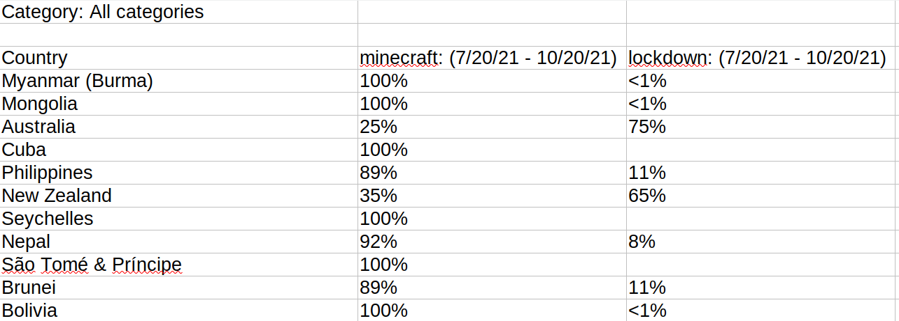

```{r xaringan-themer, include=FALSE, warning=FALSE}
#This block contains the theme configuration for the CSS lab slides style
library(xaringanthemer)
library(showtext)
style_mono_accent(
  base_color = "#5c5c5c",
  text_font_size = "1.5rem",
  header_font_google = google_font("Arial"),
  text_font_google   = google_font("Arial", "300", "300i"),
  code_font_google   = google_font("Fira Mono")
)
```

```{r setup, include=FALSE}
options(htmltools.dir.version = FALSE)
```

layout: true

<div class="my-footer"><span>David Garcia - Foundations of Computational Social Systems</span></div> 

---

# Gooogle Trends

Google Trends is a website hosted by Google that allows you to get a measurement of Google search volume for a term

<center>
  
</center>

---

# Searching for various trends

    

---

# Exporting data
    
---

# Export file format


---

# Comparing regions

A lower panel shows a comparison between countries or between regions within the country you filtered for.

    

---

# Exporting map data
    
- Check "Include low search volume regions"
---

# Export file format for maps



---

## Disambiguating queries across languages


---

# gtrendsR

- The gtrendsR package for R allows you to request google trends data within R
- Requests are done without a Google account, beware of getting blocked!

```{r, eval=F}
install.packages("gtrendsR")
```

```{r}
library(gtrendsR)
result <- gtrends(keyword = c("2013","2015"), geo = "", 
                  time="2014-01-01 2014-12-31", 
                  low_search_volume = T)
head(result$interest_over_time)
```


