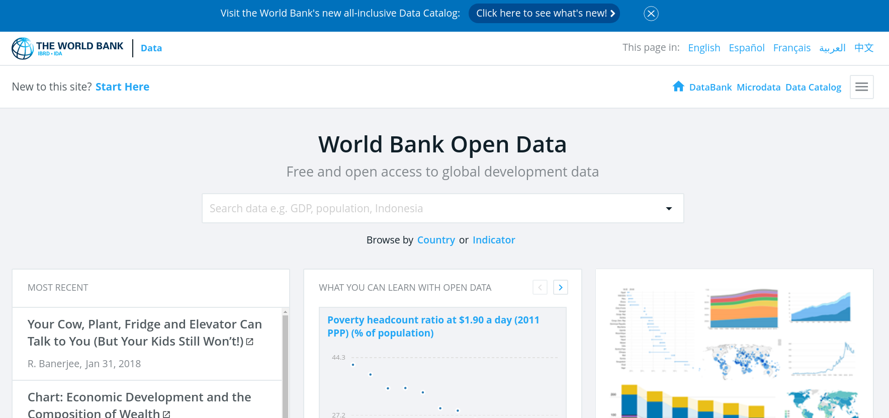
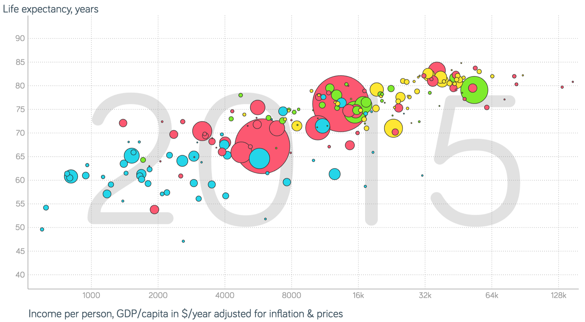
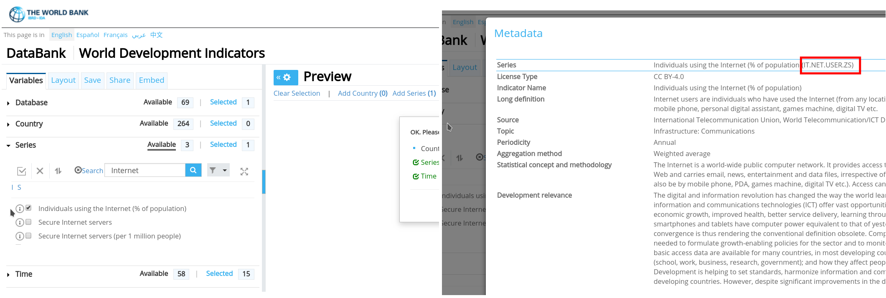

```{r xaringan-themer, include=FALSE, warning=FALSE}
#This block contains the theme configuration for the CSS lab slides style
library(xaringanthemer)
library(showtext)
style_mono_accent(
  base_color = "#5c5c5c",
  text_font_size = "1.5rem",
  header_font_google = google_font("Arial"),
  text_font_google   = google_font("Arial", "300", "300i"),
  code_font_google   = google_font("Fira Mono")
)
```

```{r setup, include=FALSE}
options(htmltools.dir.version = FALSE)
```

layout: true

<div class="my-footer"><span>David Garcia - Foundations of Computational Social Systems</span></div> 

---

# The World Bank Development Indicators

<center>
  
</center>

http://data.worldbank.org/
 
---

### Example: Life expectancy and economic development

<center>
  
</center>

https://www.gapminder.org/

---

# The WDI R package

The WDI package provides an online interface to gather World Development Indicator data

```{r eval=F}
install.packages(WDI)
library(WDI)
result = WDI(indicator=’IND.NAME’, country=’all’, start = 2014, end = 2014, extra=FALSE)
```

- country allows you to query a single country or a set
- ISO-2 country codes like ’BR’ and ’US’, or ’all’
- start and end are the years to request data for
- currently from 1960 to 2016, a single year if start=end
- indicator is a standard indicator name
  - e.g ’NY.GDP.PCAP.PP.KD’ for Gross Domestic Product per capita,’SP.POP.TOTL’ for population, etc
- extra: whether you also want additional columns per country, default ot FALSE

---

# Searching for WDI Indicators

<center>
  
</center>

- You can search for indicators at http://databank.worldbank.org/wdi
- Go to the left panel and to the "Series" tab to search
- Press the "i" button to get more information, including the standard name

---

## Example of WDI use: The Gini index in Austria

```{r }
library(WDI)
result <- WDI(indicator="SI.POV.GINI", country='AT', start = 2005, end = 2021)
result
```
