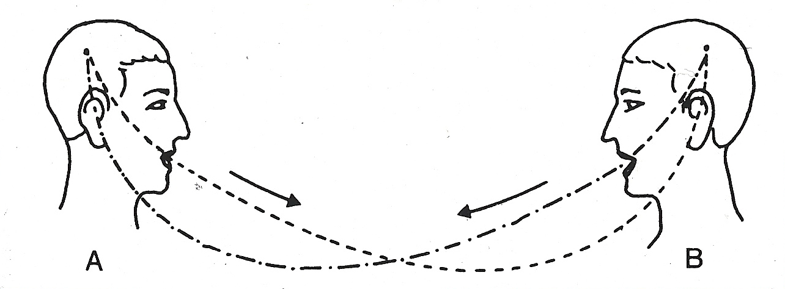
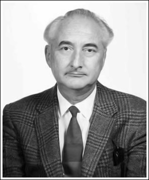
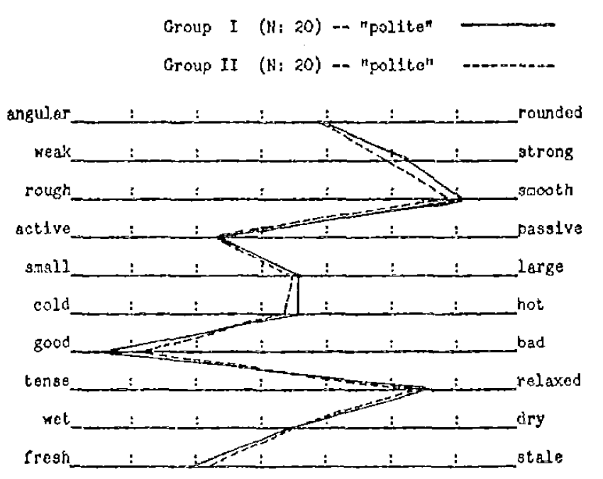
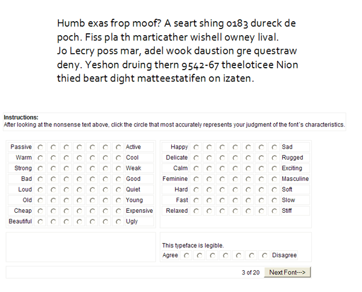
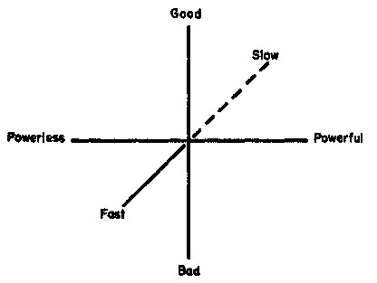

```{r xaringan-themer, include=FALSE, warning=FALSE}
#This block contains the theme configuration for the CSS lab slides style
library(xaringanthemer)
library(showtext)
style_mono_accent(
  base_color = "#5c5c5c",
  text_font_size = "1.5rem",
  header_font_google = google_font("Arial"),
  text_font_google   = google_font("Arial", "300", "300i"),
  code_font_google   = google_font("Fira Mono")
)
```

```{r setup, include=FALSE}
options(htmltools.dir.version = FALSE)
```

layout: true

<div class="my-footer"><span>David Garcia - Foundations of Computational Social Systems</span></div> 

---

# So Far

-
-
-
-

---

# Psycholinguistics: How individuals use and adopt language

.center[]   

**De Saussure's model of language**

- Language as association between signified (meaning) and signifier (word)
- Associations are normative and agreed through learning
- Human communication is composed of two steps: 
  1. Encoding: Transforming thoughts into words
  2. Decoding: Translating words into thoughts

Linguistics studies languages, their structures and properties, how they change over time, etc
Psycholinguistics studies how people use and shape languages, how their subjective states or social relationships shape the way they communicatie, etc 
Other modes of communication replace words with other kinds of symbols, such as body movements, word signs, pictorial expression, etc


# Connotative vs denotative meanings

.pull-left[]  
.pull-right[]  

- Denotative meaning: Definition of a word in reference to other meanings
  - Dictionaries formalize denotative meanings
  - Also called literal meaning or referential meaning
  
- Connotative meaning: Emotional association of the use of a word
  - Subjective component not captured by definitions, largely influenced by culture
  - Also called affective meaning or evocative meaning
  
- Sentiment analysis aims to measure the **connotative meaning** of texts

---

# The Semantic Differential

.center[]   

Osgood's Semantic Differential:
 Rating scales to measure the connotative meanings of words, objects, events (or symbols in general)

Osgood method to find the dimensions of meaning:
1. Select a set of objects/words/symbols to measure their meaning
2. Design a large set of questions or scales about the symbols
3. Ask some people to rate the symbols according to the scales
4. Apply dimensionality reduction/factor analysis
5. Interpret factors into dimensions of meaning

* The measurement of meaning. C Osgood, G Suci, P Tannenbaum, 1957 *

---


Word ratings for the semantic differential

.center[]   


- Stimulus: One word ``polite''
- Response: Ratings of each participant for the word in relation to adjectives to describe it
- The above figure shows the average of ratings for two sets of 20 participants

[The nature and measurement of meaning. C. Osgood, Psychological bulletin, 1952.](http://www.communicationcache.com/uploads/1/0/8/8/10887248/the_nature_and_measurement_of_meaning.pdf)

---

## Semantic differential example: fonts

.pull-left[.center[]]
.pull-right[.center[]]

- Stimulus: Pseudotext (meaningless but pronounceable words) in a font
- Response: Ratings for the font on the predefined scales
- The figure on the right shows the affective meaning for the \emph{French Script} font

 The semantic differential not only applies to words, but to anything that can have a connotation
 Word fonts are a great example of encoding connotative meaning without changing the denotative meaning of a text
[Know Your Typefaces! Semantic Differential Presentation of 40 Onscreen Typefaces. A. D. Shaikh.](http://usabilitynews.org/know-your-typefaces-semantic-differential-presentation-of-40-onscreen-typefaces/)

---

## Dimensionality reduction: Factor analysis
.center[]

- The N-dimensional cloud of (average) ratings of words is processed with factor analysis
- Each factor is a vector in the N-dimensional space. Factors are orthogonal to each other
- Factors are ordered such that the first one has the most variance
- The result is a smaller set of dimensions that represents the ratings of words to a large extent

---

# Three dimensions of meaning

\begin{itemize}
  \item The factor analysis of Osgood's method gives consistently 3 dimensions of meaning
  \item Replicated for words in many languages, paintings, inkblots, etc...
\end{itemize}

.pull-left[.center[]]

.pull-right[

The dimensions of the Semantic Differential (EPA):
- **Evaluation:** good, desirable -- bad, undesirable
- **Potency:** strong, powerful -- weak, powerless
- **Activation:** active, fast -- passive, slow

Evaluation has the most variance, i.e is the most explanatory
Potency and Activation have similar explanatory level below Evaluation

Image credit: [Dimensionality Reduction Methods for Molecular Motion](http://archive.cnx.org/contents/02ff5dd2-fe30-4bf5-8e2a-83b5c3dc0333@10/dimensionality-reduction-methods-for-molecular-motion)
